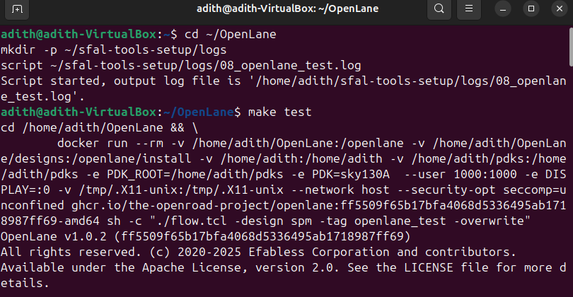

# Week 0 — Task 2: Tool Installation and Verification

## 🎯 Objective
Set up the open-source VLSI toolchain on Ubuntu and verify that each tool works correctly.  
The tools installed are:
- Yosys
- Icarus Verilog
- GTKWave
- ngspice
- Magic
- Docker
- OpenLane

---
## 🖥️ System Specs & Verification

Before installing the tools, system specifications were verified.

**Commands run:**
```bash
lsb_release -a
free -h
nproc
df -h /
```


To confirm the environment setup, the following checks were performed:
```bash
git --version
docker --version
python3 --version
python3 -m pip --version
make --version
python3 -m venv -h
```


## 🛠️ Tool Installations & Verification

### 1. Yosys
**Installation commands used:**
```bash
git clone https://github.com/YosysHQ/yosys.git
cd yosys
sudo apt install make
sudo apt-get install build-essential clang bison flex \
libreadline-dev gawk tcl-dev libffi-dev git \
graphviz xdot pkg-config python3 libboost-system-dev \
libboost-python-dev libboost-filesystem-dev zlib1g-dev
make
sudo make install
```

**Command to check version:**
```bash
yosys --version
```


### 2. Icarus Verilog
**Installation commands used:**
```bash
sudo apt-get update
sudo apt-get install iverilog
```
**Command to check version:**
```bash
iverilog -V
```


### 3. GTKWave
**Installation commands used:**
```bash
sudo apt-get update
sudo apt-get install gtkwave
```
**Command to check version:**
```bash
gtkwave --version
```


### 4. ngspice
**Command to check version:**
```bash
ngspice -v
```


### 5. Magic
**Command to check version:**
```bash
magic --version
```


### 6. Docker
**Command to check version:**
```bash
docker --version
```


### 7. OpenLane
**Commands run**
```bash
make pdk
make test
```


---

## 📌 Conclusion

All the required tools for the ASIC design flow — from simulation to physical design — were successfully installed and verified on the system.  
The environment is now fully prepared for the upcoming stages of the program, starting with RTL design in Week 1.  
This completes the Week 0 setup, ensuring a strong foundation for the end-to-end VLSI design journey.

